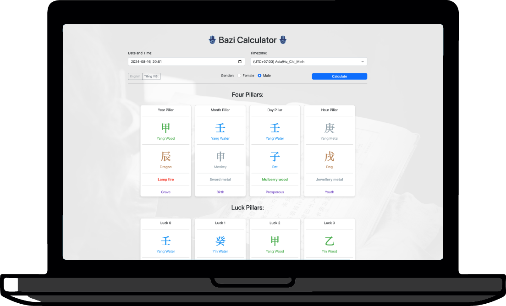

[](https://github.com/tommitoan/bazica/actions/workflows/ci.yml)
[](https://github.com/tommitoan/bazica/releases)
[](https://pkg.go.dev/github.com/tommitoan/bazica)
[](https://goreportcard.com/report/github.com/tommitoan/bazica)
[](https://github.com/tommitoan/bazica/blob/main/LICENSE)

<p align="center">
  
</p>

# Bazica (Ba-zi Chart Calculator) 
Convert Solar Calendar to Bazi Chart (Chinese astrology) with the year, month, day and hour of birth information (in Go)

<div align="center">
  
</div>

<h3 align="center">
  <a href="https://bazica.onrender.com/" target="_blank">Live Demo</a>
</h3>

## Getting started with bazica 
### Prerequisites

- **[Go](https://go.dev/)**: 1.21 or newer. CI runs the tests on Go 1.21 and on the two most recent [releases](https://go.dev/doc/devel/release).

### Importing Bazica

With [Go module](https://github.com/golang/go/wiki/Modules) support, simply add the following import

```
import "github.com/tommitoan/bazica"
```

to your code, and then `go [build|run|test]` will automatically fetch the necessary dependencies.

Otherwise, run the following Go command to install the `bazica` package:

```sh
go get -u github.com/tommitoan/bazica@latest
```

## Data

The solar term and Lunar New Year tables are embedded in the module (`go:embed`), so nothing has to be copied into your project and the library works from any working directory, including a vendored build or a container image with only the binary.

The same tables are also published as JSON in the `data` folder if you want to use them elsewhere:

- `data/solar-term.json`: the 24 solar terms for each year, in UTC.
- `data/lunar-new-year.json`: the Lunar New Year date for each year.

## How to use

```go
package main

import (
	"encoding/json"
	"fmt"
	"github.com/tommitoan/bazica"
	"time"
)

func main() {
	// Calculate current ba-zi chart
	loc, _ := time.LoadLocation("Asia/Ho_Chi_Minh")
	now := time.Now()
	gender := 0 // 0 = female & 1 = male
	
	/* Example: 
	Time to calculate: 1990-12-31 6:30 - Timezone: HoChiMinh / Vietnam - Gender: Male
	loc, _ := time.LoadLocation("Asia/Ho_Chi_Minh")
	now := time.Date(1990, time.Month(12), 31, 6, 30, 0, 0, loc)
	gender := 1
	*/

	chart, err := bazica.GetBaziChart(now, loc, gender)
	if err != nil {
		fmt.Println(err)
		return
	}
	jsonData, _ := json.Marshal(chart)
	fmt.Println(string(jsonData))
}
```
## Analysis

From v1.4.0 every chart also carries derived facts under an `analysis` key. The fields that existed in v1.3.0 are unchanged, and every added key is named `analysis`, so existing clients keep working.

| Where | Field | Meaning |
|---|---|---|
| each natal pillar | `ten_god` | stem against the Day Master (`null` on the day pillar) |
| | `stem_element`, `branch_element`, `nayin` | five elements and the Nayin |
| | `stem_stage_at_own_branch`, `stem_stage_at_month_branch`, `day_master_stage` | the twelve life stages |
| | `hidden_stems` | stems hidden in the branch, main qi first, each with its Ten God and stage |
| | `is_void`, `heaven_earth_clash` | void branch and clash flags |
| | `stars` | the 58 verified stars, in a fixed order (empty list when none); each carries `nature` (see below) |
| each luck pillar | `age_start`, `age_end` | nominal age range |
| | `ten_god`, `nayin`, `stem_stage_at_own_branch`, `hidden_stems`, `heaven_earth_clash` | as above |
| chart | `day_master`, `void_branches` | the Day Master and the two void branches |
| | `thai_nguyen`, `thai_tuc`, `life_palace` | conception, gestation and life palace pillars with their Nayin |
| | `element_counts` | unweighted counts of stems, branches and hidden stems per element |
| | `day_master_strength`, `useful_god` | reserved, always `null` |

Every named concept (Ten God, life stage, element, polarity, Nayin, star) is an object with a stable `code` and an English and a Vietnamese label:

```json
{"code": "ten_god.hurting_officer", "en": "Hurting Officer", "vi": "Thương Quan"}
```

Switch on `code`, not on a label. A UI can show either language without recalculating the chart.

`GetAnnualPillars(chart, fromYear, count)` returns the pillar of each year with its Ten God, life stage, nominal age, the luck pillar it falls in and the clash flag:

```go
chart, _ := bazica.GetBaziChart(birth, loc, model.GenderMale)
annual, err := bazica.GetAnnualPillars(chart, 2026, 10)
if err != nil { // model.ErrInvalidYearRange
	return err
}
for _, y := range annual.AnnualPillars {
	fmt.Println(y.Year, y.NominalAge, y.HeavenlyStem.Name, y.EarthlyBranch.Name, y.TenGod.EN)
}
```

`fromYear` may not precede the year pillar's year and the years must lie within 1900 to 2099.

### Analysis conventions
- **Nominal age**: the year of the year pillar is age 1. For a January birth before the Lunar New Year the year pillar belongs to the previous year, so ages count from there.
- **Stars**: only stars whose rules were verified against reference charts are reported (58 stars, checked on 298 recorded charts and 10,000 random births against an independent implementation). Other stars are never guessed. Several rules differ from the classical tables because they follow the reference page, for example Red Allure (`hong_diem`) reads both the day stem and the year stem, and Great Depletion (`dai_hao`) depends on gender.
- **Star nature**: each star term has an optional `nature` key, set on stars only: `auspicious` (cát), `inauspicious` (hung) or `mixed` (tùy cục, the effect depends on the rest of the chart). It is a hint for display. Schools disagree about what is favourable and many stars cut both ways, so the value is not a judgement of the chart. The reference page labels stars only good or bad; the library follows it except for 10 stars it reads as mixed and one (`am_duong_sat`) it reads as inauspicious where the page says good. Other terms (Ten Gods, stages, elements, Nayin) never carry the key. It is additive: a client that ignores it keeps working.
- **Moon General** (`thai_duong`): the general changes at each principal term, and the whole calendar day on which a term falls already has the new general. The reference page dates a few terms one day off, so on a term day the result can differ from the page by one day.
- **Life palace**: Rat and Ox are counted before Tiger when the stem is derived, which differs from the classical month order.
- **Heaven-clash/earth-clash**: directional. A cell is flagged when its stem overcomes another natal pillar's stem with the same polarity and their branches are opposite. Earth stems take part.
- **Strength and Useful God**: not computed.

## Note
### Data Input Limitations:
Due to the specific calculations and algorithms used in this package, it is currently designed to handle date inputs ranging from January 1, 1900, to December 31, 2099. Dates outside this range return `model.ErrDateOutOfRange`.   

### Conventions
- **Day**: the day changes at 23:00 (the Rat hour), so a birth at 23:30 takes the pillar of the next day.
- **Year**: the year changes at the Lunar New Year (`data/lunar-new-year.json`).
- **Month**: the month changes at the "initial" solar terms (jie), such as Start of Spring and Awakening of Insects.
- **Time zone**: `dateTime` is read as wall-clock time in `loc`, so pass the birth place's zone. A nil `loc` keeps the zone `dateTime` already carries.
- **Gender**: `0` is female and `1` is male (`model.GenderFemale`, `model.GenderMale`); it sets the direction of the luck pillars. Other values return `model.ErrInvalidGender`.

If you require calculations for dates outside this range, please consider alternative libraries or solutions.

###  Ho Chi Minh City 1975
Ho Chi Minh City (formerly Saigon) has gone through time zone changes throughout history. Notably:  
Before 1975: South Vietnam (including Saigon) used UTC+8.  
After 1975: The unified Vietnam adopted UTC+7.

## References

This project drew inspiration and information from the following sources:

* **[Thời Gian](https://www.thoigian.com.vn/)** - A comprehensive resource for understanding the Vietnamese calendar system.
* **[Chinese Fortune Calendar](https://www.chinesefortunecalendar.com/)** - Provided insights into the Chinese calendar, calculations, and cultural significance.


### Document
https://www.geomancy.net/forums/topic/10229-understand-the-chinese-lunar-and-xia-calendar-in-ba-zi-four-pillars-used-by-various-masters-and-why-not-to-totally-depend-on-just-the-xia-hsia-seasonal-solar-calendar-alone/

The article above discusses the Lunar and Hsia (seasonal, solar term) calendars used to read the Four Pillars. Bazica uses a mix of both: the year follows the lunar calendar and the month follows the solar terms. An example chart:

```
Date time: 2024-07-05 22:00 UTC+7 (Vietnam)  

Year: Yang Wood - Dragon (Lunar Calendar Year)  
Month: Yang Metal - Horse (Solar-Term Calendar Month)  
Day: Yang Metal - Horse (Lunar Calendar Day)   
Hour: Yin Wood - Pig (Zodiac Hour)
```


