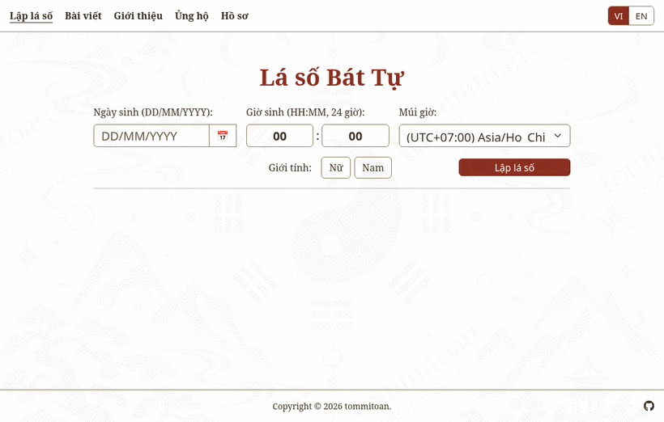
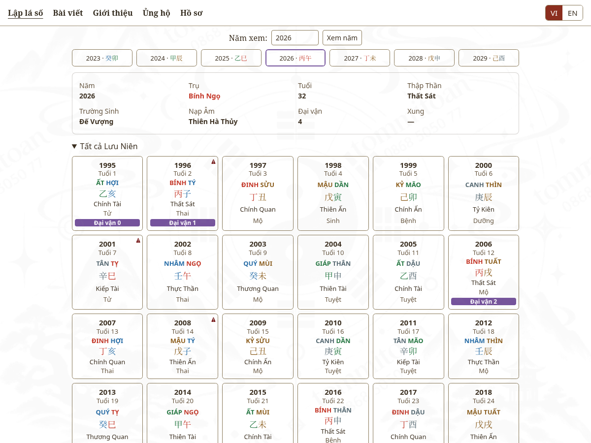

[](https://github.com/tommitoan/bazica/actions/workflows/ci.yml)
[](https://github.com/tommitoan/bazica/releases)
[](https://pkg.go.dev/github.com/tommitoan/bazica/v2)
[](https://goreportcard.com/report/github.com/tommitoan/bazica/v2)
[](https://github.com/tommitoan/bazica/blob/master/LICENSE)

<p align="center">
  
</p>

# Bazica (Ba-zi Chart Calculator)

**English** · [Tiếng Việt](README.vi.md)

Bazica is a Go library that turns a Gregorian birth time into a Ba-zi (Four Pillars of Destiny, Chinese astrology) chart: the year, month, day and hour pillars, the luck pillars, the yearly pillars, and a layer of derived facts (Ten Gods, life stages, hidden stems, Nayin, stars and more). Every label comes in English and Vietnamese.

<div align="center">
  
  <br>
  <sub>The companion web app, <a href="https://github.com/tommitoan/bazica-web">bazica-web</a>, built on this library.</sub>
</div>

<h3 align="center">
  <a href="https://bazi.tommitoan.com/" target="_blank">Live Demo</a>
</h3>

## Highlights

- **Four pillars** with the year pillar changing at the instant of Lichun (Start of Spring) and the month at the solar terms, from 1700 to 2399.
- **Luck pillars** (Da Yun) with their direction, start time, years and nominal ages.
- **Yearly pillars** (`GetAnnualPillars`) with Ten God, life stage, the luck pillar a year falls in, and a clash flag.
- **Analysis** on every chart: Ten Gods, twelve life stages, hidden stems, Nayin, void branches, heaven-clash/earth-clash, 58 verified stars, conception, gestation and life palace pillars, and element counts.
- **Bilingual terms with stable codes**: every named concept is `{code, en, vi}`, so a UI can switch language without recalculating.
- **No data files to ship**: the solar term and Lunar New Year tables are embedded in the module. The tables are generated from the JPL DE440 ephemeris by `tools/gencal`.
- **Careful testing**: results are compared with a second implementation and with recorded reference charts (see "Accuracy and checks").

## Getting started

### Prerequisites

- **[Go](https://go.dev/)**: 1.21 or newer. CI runs the tests on Go 1.21 and on the two most recent [releases](https://go.dev/doc/devel/release).

### Installing

```sh
go get github.com/tommitoan/bazica/v2@latest
```

and import it:

```go
import "github.com/tommitoan/bazica/v2"
```

The module path ends in `/v2` (Go requires the suffix from v2 on). A plain `github.com/tommitoan/bazica` import stays on v1.5.0; see "Version 2" below for what changed.

### A first chart

```go
package main

import (
	"fmt"
	"log"
	"time"

	"github.com/tommitoan/bazica/v2"
	"github.com/tommitoan/bazica/v2/model"
)

func main() {
	// 1990-12-31 06:30, Ho Chi Minh City, male.
	loc, err := time.LoadLocation("Asia/Ho_Chi_Minh")
	if err != nil {
		log.Fatal(err)
	}
	birth := time.Date(1990, time.December, 31, 6, 30, 0, 0, loc)

	chart, err := bazica.GetBaziChart(birth, loc, model.GenderMale)
	if err != nil {
		log.Fatal(err) // for example model.ErrDateOutOfRange
	}

	p := chart.FourPillar
	fmt.Println("year: ", p.YearPillar.HeavenlyStem.Name, p.YearPillar.EarthlyBranch.Name)
	fmt.Println("month:", p.MonthPillar.HeavenlyStem.Name, p.MonthPillar.EarthlyBranch.Name)
	fmt.Println("day:  ", p.DayPillar.HeavenlyStem.Name, p.DayPillar.EarthlyBranch.Name)
	fmt.Println("hour: ", p.HourPillar.HeavenlyStem.Name, p.HourPillar.EarthlyBranch.Name)
	fmt.Println("day master:", chart.Analysis.DayMaster.HeavenlyStem.Name, "/", chart.Analysis.DayMaster.Element.VI)

	for _, lp := range chart.LuckPillars.LuckPillars[:3] {
		fmt.Printf("luck pillar %d: %s %s, %d-%d\n", lp.Number, lp.HeavenlyStem.Name, lp.EarthlyBranch.Name, lp.YearStart, lp.YearEnd)
	}

	annual, err := bazica.GetAnnualPillars(chart, 2026, 2)
	if err != nil {
		log.Fatal(err)
	}
	for _, y := range annual.AnnualPillars {
		fmt.Println(y.Year, y.NominalAge, y.HeavenlyStem.Name, y.EarthlyBranch.Name, y.TenGod.EN)
	}
}
```

Output:

```
year:  Yang Metal Horse
month: Yang Earth Rat
day:   Yang Metal Horse
hour:  Yin Earth Rabbit
day master: Yang Metal / Kim
luck pillar 0: Yang Earth Rat, 1990-1991
luck pillar 1: Yin Earth Ox, 1992-2001
luck pillar 2: Yang Metal Tiger, 2002-2011
2026 37 Yang Fire Horse Seven Killings
2027 38 Yin Fire Goat Direct Officer
```

`GetBaziChart` returns a `*model.BaziChart` that marshals to JSON (`json.Marshal(chart)`), so it also works as the back end of an API. Luck pillar `0` is the birth month pillar, which applies until the first luck pillar starts. Runnable examples with tested output are in `example_test.go` and on [pkg.go.dev](https://pkg.go.dev/github.com/tommitoan/bazica/v2).

### Birth range and data

Birth dates from January 1, 1700, to December 31, 2399 are supported. `bazica.SupportedYears()` returns the first and last year, taken from the embedded calendar tables; dates outside the range return `model.ErrDateOutOfRange`.

The solar term and Lunar New Year tables are embedded in the module (`go:embed`), so nothing has to be copied into your project and the library works from any working directory, including a vendored build or a container image with only the binary. The same tables are published as JSON in the `data` folder if you want to use them elsewhere:

- `data/solar-term.json`: the 24 solar terms for each year, in UTC.
- `data/lunar-new-year.json`: the Lunar New Year date for each year. It feeds only the display-only `year_reference` block; no pillar is calculated from it.

## Version 2

`v2.0.0` changes the module path to `github.com/tommitoan/bazica/v2` (Go requires the suffix from v2 on); no function or type was renamed or removed, so updating means changing the import path and running `go get github.com/tommitoan/bazica/v2@latest`. v1.5.0 stays available for anyone who wants the previous behaviour.

**What changed in the results.** The year pillar now changes at the instant of Lichun instead of the Lunar New Year, the way solar-term Ba-zi calculators do. Charts for births outside the two windows below are unchanged (a test compares 658 of them with v1.5.0). For a birth between the Lunar New Year and Lichun, or between Lichun and the Lunar New Year (about 2 % of births, 7.4 days a year on average, 16 at most), these change:

- the year pillar and everything derived from it (Ten God, hidden stems, life stage and Nayin of the year pillar);
- the stars: a star changes when its rule starts from the year pillar or when it lands in the year or month pillar, which covers most of the table. In a check of every such day of 1901-2099, both genders, **every** chart had at least one different star and 39 star terms were involved, so treat the stars of these births as new;
- the month stem (the month branch follows the solar term as before);
- the direction and the sequence of the luck pillars, because the year stem's polarity decides the direction, and the first row of the yearly table with the nominal age.

The day and hour pillars never change. The results were checked against a second implementation (lunar-javascript) for every such day of 1901-2099, both genders: four pillars, first luck pillar and luck direction (`testdata/calendar/lunarjs-window-1901-2099.json`).

**What was added.** `analysis.year_reference` reports, for every chart and for display only, the Lichun time of the birth's civil year (in the birth zone), the year of the lunar calendar with its stem, branch, zodiac animal and Lunar New Year date, and `differs`, which is true when that lunar-calendar year is not the year pillar. Nothing is calculated from it; a test guards that.

The lunar-calendar year follows the Lunar New Year table, which holds one date per year and follows the Chinese calendar (UTC+8), whatever `loc` you pass. Vietnam's calendar (UTC+7) places the Lunar New Year on another day in some years: in 1900-2099 these are 1903, 1935, 1965, 1968, 1969, 1985, 2007, 2030 and 2053 (`tools/gencal/README.md` has the comparison; later years were not checked). On that one day of such a year, `lunar_year` and `differs` can disagree with a Vietnamese almanac. No pillar is affected, because the year pillar follows Lichun.

## Analysis

From v1.4.0 every chart also carries derived facts under an `analysis` key. The fields that existed in v1.3.0 are unchanged, and every added key is named `analysis`, so existing clients keep working.

| Where | Field | Meaning |
|---|---|---|
| each natal pillar | `ten_god` | stem against the Day Master (`null` on the day pillar) |
| | `stem_element`, `branch_element`, `nayin` | five elements and the Nayin |
| | `stem_stage_at_own_branch`, `stem_stage_at_month_branch`, `day_master_stage` | the twelve life stages |
| | `hidden_stems` | stems hidden in the branch, main qi first, each with its Ten God and stage |
| | `is_void`, `heaven_earth_clash` | void branch and clash flags |
| | `stars` | the 58 verified stars, in a fixed order (empty list when none); each carries `nature` (see below) |
| each luck pillar | `age_start`, `age_end` | nominal age range |
| | `ten_god`, `nayin`, `stem_stage_at_own_branch`, `hidden_stems`, `heaven_earth_clash` | as above |
| chart | `day_master`, `void_branches` | the Day Master and the two void branches |
| | `year_reference` | display only: the Lichun time of the birth year, the year of the lunar calendar (stem, branch, zodiac animal, Lunar New Year date) and `differs` (see "Version 2") |
| | `thai_nguyen`, `thai_tuc`, `life_palace` | conception, gestation and life palace pillars with their Nayin |
| | `element_counts` | unweighted counts of stems, branches and hidden stems per element |
| | `day_master_strength`, `useful_god` | reserved, always `null` |

Every named concept (Ten God, life stage, element, polarity, Nayin, star) is an object with a stable `code` and an English and a Vietnamese label:

```json
{"code": "ten_god.hurting_officer", "en": "Hurting Officer", "vi": "Thương Quan"}
```

Switch on `code`, not on a label. A UI can show either language without recalculating the chart.

`GetAnnualPillars(chart, fromYear, count)` returns the pillar of each year with its Ten God, life stage, nominal age, the luck pillar it falls in and the clash flag:

```go
chart, _ := bazica.GetBaziChart(birth, loc, model.GenderMale)
annual, err := bazica.GetAnnualPillars(chart, 2026, 10)
if err != nil { // model.ErrInvalidYearRange
	return err
}
for _, y := range annual.AnnualPillars {
	fmt.Println(y.Year, y.NominalAge, y.HeavenlyStem.Name, y.EarthlyBranch.Name, y.TenGod.EN)
}
```

`fromYear` may not precede the year pillar's year or the first supported birth year (see `SupportedYears`), and the years must not pass 9999. The yearly table is not limited to the range of a birth date: each year's pillar is the sixty-year cycle, so it continues after 2399 (a luck pillar number is `null` once a year is past the twelfth luck pillar).

### Analysis conventions

- **Nominal age**: the year of the year pillar is age 1. For a birth before Lichun the year pillar belongs to the previous year, so ages count from there. This is the Ba-zi count, not the everyday count from the Lunar New Year.
- **Stars**: only stars whose rules were verified against reference charts are reported (58 stars, checked on 298 recorded charts and 10,000 random births against an independent implementation). Other stars are never guessed. Several rules differ from the classical tables because they follow the reference page, for example Red Allure (`hong_diem`) reads both the day stem and the year stem, and Great Depletion (`dai_hao`) depends on gender.
- **Star nature**: each star term has an optional `nature` key, set on stars only: `auspicious` (cát), `inauspicious` (hung) or `mixed` (tùy cục, the effect depends on the rest of the chart). It is a hint for display. Schools disagree about what is favourable and many stars cut both ways, so the value is not a judgement of the chart. The reference page labels stars only good or bad; the library follows it except for 10 stars it reads as mixed and one (`am_duong_sat`) it reads as inauspicious where the page says good. Other terms (Ten Gods, stages, elements, Nayin) never carry the key. It is additive: a client that ignores it keeps working.
- **Moon General** (`thai_duong`): the general changes at each principal term, and the whole calendar day on which a term falls already has the new general. The reference page dates a few terms one day off, so on a term day the result can differ from the page by one day.
- **Life palace**: Rat and Ox are counted before Tiger when the stem is derived, which differs from the classical month order.
- **Heaven-clash/earth-clash**: directional. A cell is flagged when its stem overcomes another natal pillar's stem with the same polarity and their branches are opposite. Earth stems take part.
- **Strength and Useful God**: not computed.

## Conventions

- **Day**: the day changes at 23:00 (the Rat hour), so a birth at 23:30 takes the pillar of the next day.
- **Year**: the year changes at the instant of Lichun (Start of Spring), the same solar-term clock as the month; the comparison uses the exact instant, so the 23:00 day rule does not apply to it.
- **Month**: the month changes at the "initial" solar terms (jie), such as Start of Spring and Awakening of Insects. The month stem follows from the year stem by the Five Tigers rule.
- **Lunar-calendar year (reference)**: the year that changes at the Lunar New Year, reported under `analysis.year_reference` for display only. It follows the civil date (the lunar calendar changes year at midnight, so the 23:00 day rule does not apply to it). For a birth between the Lunar New Year and Lichun it differs from the year pillar.
- **Time zone**: `dateTime` is read as wall-clock time in `loc`, so pass the birth place's zone. A nil `loc` keeps the zone `dateTime` already carries.
- **Gender**: `0` is female and `1` is male (`model.GenderFemale`, `model.GenderMale`); it sets the direction of the luck pillars. Other values return `model.ErrInvalidGender`.

### Accuracy and checks

The two tables (`data/solar-term.json` and `data/lunar-new-year.json`) are generated by `tools/gencal` from the JPL DE440 ephemeris, which also says how and how accurately. Lunar New Year follows the Chinese calendar (UTC+8, and Beijing mean time before 1929). The accuracy of a solar term depends on Delta T, the difference between uniform time and Earth's rotation: it is reconstructed from observations up to the present, so terms are good to a few seconds from 1700 to 2025, and a prediction after that, so the uncertainty grows to minutes by 2399. A check against a second, independent package (a different method and its own Delta T) agrees within about a minute from 1700 to 2000; after 2100 the two Delta T predictions differ by 3 to 5 minutes, so a birth within about five minutes of a solar term is uncertain there, and so are the Lunar New Years of 2299 and 2333. A birth within that margin of a solar term, Lichun included, may get the neighbouring month or year pillar. The Lunar New Years of 2299 and 2333 are as uncertain, and they only affect the display-only lunar-calendar year.

Before about 1900 many places used local mean time. `bazica` reads the wall-clock time in the `loc` you pass, so pass the zone (or fixed offset) that was in use at the birth place.

If you require calculations for dates outside the supported range, please consider alternative libraries or solutions.

### Ho Chi Minh City 1975

Ho Chi Minh City (formerly Saigon) has gone through time zone changes throughout history. Notably:
Before 1975: South Vietnam (including Saigon) used UTC+8.
After 1975: The unified Vietnam adopted UTC+7.

## The web app

[bazica-web](https://github.com/tommitoan/bazica-web) is a Go server and a static page built on this library. It has no Ba-zi logic of its own: it validates the request and calls `GetBaziChart` and `GetAnnualPillars`. The page shows the four pillars with their full facts, the Five Elements diagram, the star map, the luck pillars and a card for each of sixty years, in Vietnamese or English, with shareable chart links and an optional PDF export.

<div align="center">
  
</div>

## Development

```sh
go test -race -cover ./...
gofmt -l .
go vet ./...
```

`tools/gencal` regenerates the two calendar tables; its README explains the method and the checks.

## References

This project drew inspiration and information from the following sources:

* **[Thời Gian](https://www.thoigian.com.vn/)** - A comprehensive resource for understanding the Vietnamese calendar system.
* **[Chinese Fortune Calendar](https://www.chinesefortunecalendar.com/)** - Provided insights into the Chinese calendar, calculations, and cultural significance.
* **[Understand the Chinese Lunar and Xia calendar in Ba-zi](https://www.geomancy.net/forums/topic/10229-understand-the-chinese-lunar-and-xia-calendar-in-ba-zi-four-pillars-used-by-various-masters-and-why-not-to-totally-depend-on-just-the-xia-hsia-seasonal-solar-calendar-alone/)** - A discussion of the lunar and Hsia (seasonal, solar term) calendars used to read the Four Pillars. Bazica follows the solar-term calendar for both the year and the month since v2.0.0; v1 changed the year at the Lunar New Year.

## License

MIT, see [LICENSE](LICENSE).
